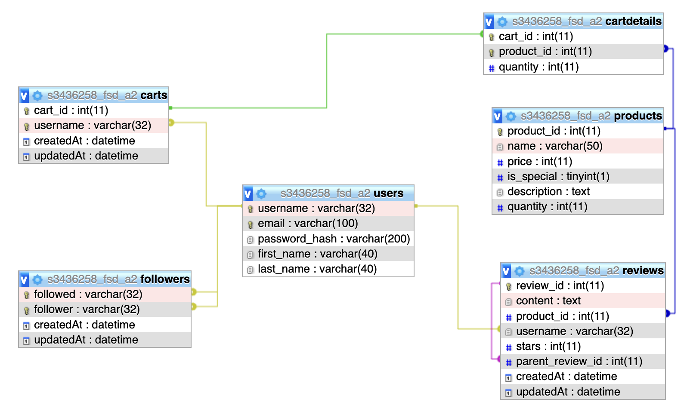

# SOIL Full Stack Web Application

## Table of Contents

- [Overview](#overview)
- [Features](#features)
- [Database Schema](#database)
- [Prerequisites](#prerequisites)
- [Running the Application](#running-the-application)
- [Unit Tests](#unit-tests)
- [Env Variables](#env-variables)
- [Troubleshooting](#troubleshooting)
- [Documentation](#documentation)
- [References](#references)
- [Admin Dashboard](#admin-dashboard)

## Overview

SOIL is an organic food shop web application built using a modern web stack (Cloud MySQL, ReactJS, Express.js with Sequelize ORM, Node.js). This application provides a platform for users to browse products, leave reviews, manage their shopping cart, and make purchases.

## Features

- **User Authentication**

  - Sign up and sign in with form validation
  - Strong password validation with a strength meter

- **User Profile**

  - Edit profile details
  - Validation for profile updates

- **Product Management**

  - Display products with average user star ratings
  - Add products to the cart with custom quantity inputs

- **Reviews**

  - Leave reviews and threaded replies
  - Edit and delete reviews
  - Star rating system
  - Custom-built pagination for reviews
  - Word limit validation for reviews

- **Cart Management**

  - Add to cart / Remove from cart
  - Increment/decrement quantity
  - Custom quantity input
  - Clear cart

- **Checkout**

  - Display purchase summary
  - Handle empty cart scenarios

- **Backend API**

  - All operations implemented with backend APIs
  - Data stored in a cloud MySQL database

## Database

- Application uses Cloud MySQL Relational Database.

  [Link to DB Schema](./backend/soil_db_schema.png)
  

- Database will be created when express server is launched.
- Data including users, products, and reviews will be seeded for demo purposes.

## Prerequisites

- Node.js (^v21.7.1)
- npm (included with Node.js)

## Running the Application

To run the application:

1. Navigate to the **_/frontend_** directory and run `npm install` to install frontend dependencies. (Note: Some dependencies are required for running unit tests).
2. Navigate to the **_/backend_** directory and run `npm install` to install backend dependencies.
3. Create a `.env` file in the root of the **_/backend_** directory (see [Environment Variables](#env-variables)).
4. From the **_/backend_** directory, run `npm start` to start the Express server (on the PORT defined in .env).
5. From the **_/frontend_** directory, run `npm start` to start the frontend server.

The application can be accessed locally at `localhost:3000`, assuming port 3000 is available.

## Unit Tests

There are **4** unit tests in **2** suites.

3 unit tests for cart operations (in `cart.test.js`),

1 unit test for reviews (in `productpage.test.js`).

To run tests, navigate into the _/frontend_ directory and run `npm test`.

If running `npm test` does not run all tests (2 suites, 4 tests), try running:

```sh
npm test -- --watchAll=false
```

## Env Variables

Ensure you have created a `.env` file in the root directory of _/backend_. These are required for database credential configuration.

The `.env` file should contain your credentials for database configuration and PORT for express. Please follow the following structure:

```sh
DB_USER: "your_db_username"
DB_PASSWORD: "your_db_password"
DB: "your_db_name"
PORT: 4000 (or your desired port to host backend server)
```

See [config.js](/backend/src/database/config.js) for reference.

## Troubleshooting

If you encounter issues with missing dependencies or environment errors, try running: `npm install`

Please remember to run `npm install` in **_both_** the /backend and /frontend directories.

If issues arise with database credentials, verify your `.env` file is correctly configured and located in the **root** of _./backend_ directory.

### Issues with database creation

The database tables are created upon starting express. Sequelize will create tables and populate them with seed data. Sequelize is configured to force this process on express server launch, regardless of the state of your database.

If you face issues with table creation, ensure there are **no existing tables** in your database that could be causing problems (like FK constraint errors) for sequelize to generate tables.

The easiest way to do so is by manually dropping all tables and re-starting the express server.

## Documentation

Docs generated with JSDoc.

[Frontend docs](./frontend/docs/)

[Backend docs](./backend/docs/)

To regenerate documentation, run command: `npm run doc`.

## References

- Images sourced from [unsplash](https://unsplash.com/)
- [Password Strength Tutorial](https://www.youtube.com/watch?v=AIgLWy604AA)
- [Regex Guide for Javascript](https://www.freecodecamp.org/news/regular-expressions-for-beginners/)
- [React Testing Library Tutorial Series](https://www.youtube.com/playlist?list=PL4cUxeGkcC9gm4_-5UsNmLqMosM-dzuvQ)
- [Custom Pagination Component](https://retool.com/blog/how-to-build-a-custom-pagination-component-in-react)

## Admin Dashboard

In development - TBC.

[Back to top](#soil-full-stack-web-application)
